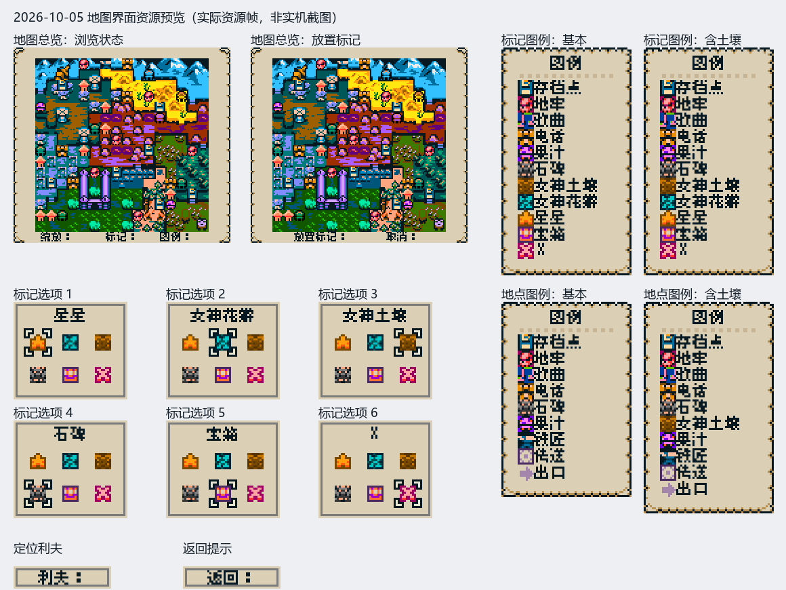
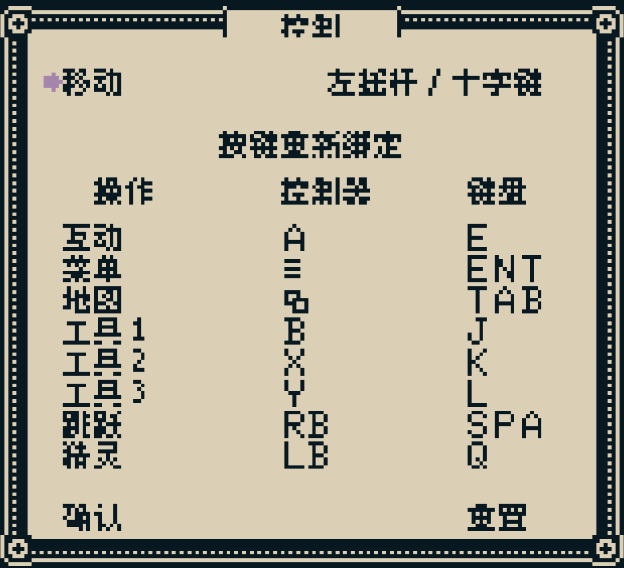

# Isle of Reveries 简体中文汉化补丁

为 Steam 版 **Isle of Reveries** 制作的简体中文汉化补丁。项目包含可直接安装的补丁包、汉化词典、像素字体资源、构建工具和校验脚本。

> 当前补丁信息见 [版本.txt](版本.txt)。根目录的 `www/assets.dat` 是可直接使用的汉化资源包。

## 功能

- 汉化对白、物品说明、菜单、任务、提示、地图、控制设置、存档界面、图鉴和其他玩家可见文本。
- 针对 Construct 3 资源包中的多个 SpriteFont 对象生成中文像素字形。
- 支持对白、菜单、物品说明、HUD 和按键提示等不同字号与字距。
- 按 CJK 规则处理中文换行，并调整中文文本框的布局间距。
- 重绘无法通过普通文本钩子替换的图片内文字，例如地图标记、控制页面和部分菜单标签。
- 安装器会校验游戏资源版本，备份英文原包，并防止用不匹配的补丁覆盖新版游戏。
- 卸载器可以在备份完整且版本匹配时恢复英文资源；官方更新后可重新构建对应版本的汉化包。

## 安装

使用发布压缩包时，先完整解压，再修改游戏路径并运行 `安装.bat`，无需安装 Git。以下步骤适用于从 Git 仓库下载。

1. 退出游戏。
2. 安装 Git，运行下面的命令下载补丁：

   ```powershell
   git clone https://github.com/ZzySlhbcf/IsleOfReveriesHan.git
   cd IsleOfReveriesHan
   ```

3. 打开下载好的 `IsleOfReveriesHan` 文件夹，查看 [版本.txt](版本.txt)，确认补丁支持你的游戏版本。
4. 更改 `安装.bat`、`卸载.bat` 和 `官方更新后重建.bat` 里的游戏路径为实际安装路径。
5. 双击 `安装.bat`，按提示安装。
6. 打开游戏。

补丁只替换 `www/assets.dat`，不改游戏 EXE、存档或 Steam 设置。

## 修改游戏路径

三个 BAT 文件里的默认路径都是：

```bat
set "GAME=D:\Games\Steam\steamapps\common\Isle of Reveries"
```

如果游戏不在这个位置，就需要修改：

1. 在 Steam 库中右键 **Isle of Reveries** → **管理** → **浏览本地文件**。
2. 复制地址栏里的路径。
3. 用记事本打开补丁里的 `安装.bat`、`卸载.bat` 和 `官方更新后重建.bat`。
4. 找到开头的 `set "GAME=..."`，把等号后面的路径换成你的游戏路径。比如游戏装在 E 盘：

   ```bat
   set "GAME=E:\SteamLibrary\steamapps\common\Isle of Reveries"
   ```

5. 保存三个文件，保留原来的编码和 `.bat` 扩展名。

## 卸载

退出游戏，双击 `卸载.bat` 即可恢复英文。脚本会先检查备份是否匹配；如果备份丢失或版本不对，在 Steam 里验证游戏文件完整性即可恢复。

## 游戏更新后

Steam 更新可能会覆盖汉化文件。更新后请重新安装适配当前游戏版本的补丁。

### 更新补丁

1. 查看 [版本.txt](版本.txt)，确认补丁支持当前游戏版本。如果还没有对应版本，请等待更新。
2. 退出游戏，在本地补丁文件夹里打开终端，运行：

   ```powershell
   git pull --ff-only
   ```

3. 检查三个 BAT 文件里的游戏路径。如果更新后恢复了默认路径，重新修改。
4. 双击新版 `安装.bat`。

如果安装时提示版本不匹配，请等待对应版本的补丁，或尝试下面的重建步骤。

### 重建补丁

依赖：Python 3、Node.js，以及 Python 包 Pillow、NumPy。

```powershell
python -m pip install pillow numpy
```

Steam 更新完成后，退出游戏，修改 `官方更新后重建.bat` 中的 `GAME` 路径并运行脚本。脚本会备份新版英文资源、生成补丁、校验并安装。

游戏更新后，备份的英文文件可能已经过时。如果想恢复英文，建议直接在 Steam 里验证游戏文件完整性。

## 构建与开发

源码位于 `mod_src/`，主要部分如下：

```text
mod_src/
├── fonts/                 # 像素字体与各字体的许可证
├── trans/dict.json        # 英中译文字典
└── tools/
    ├── c3bundle.py        # Construct 3 资源包解包/重打包
    ├── build_cn_patch.py  # 生成中文字体、词典钩子和资源包
    ├── make_dist.py       # 生成交付目录与安装脚本
    ├── update_repack.py   # 以官方新版资源为底重建补丁
    ├── validate_dist.py   # 资源包完整性校验
    └── verify_glyphs.py   # 字形像素校验
```

官方更新后的自动重建命令也可以在命令行运行：

```powershell
python mod_src/tools/update_repack.py --game "D:\Games\Steam\steamapps\common\Isle of Reveries"
```

只生成而不安装到游戏目录：

```powershell
python mod_src/tools/update_repack.py --game "D:\Games\Steam\steamapps\common\Isle of Reveries" --no-install
```

若新版游戏修改了资源图片，重建脚本会停止，避免用旧坐标覆盖新版图片。

## 当前版本与验证

截至 **2026 年 10 月 6 日**（本机 Steam Build **25744523**），发布包包含 4,195 条英中对照译文、1,873 个中文字符，资源包信息和 MD5 见 [版本.txt](版本.txt)。已完成的检查包括：

- 资源包解包与重打包结构校验；
- 中文字形逐格像素比对，检查缺字、翻转和错位；
- 安装、卸载和官方更新后重建脚本的测试；
- 译文一致性、审校词条、地图标记、控制页和存档摘要排版回归检查。

2026-10-06 适配版已完成 28 项回归检查、44,952 格字形比对、安装/卸载测试及两种发布工具重建测试。新版小地图和新增图集完整保留；已确认的黑色 SPA、键盘、女神花瓣、存档点、X、时锁别墅及排版修复继续生效。尚未完成新版全流程实机游玩验证。

更新详情见 [更新适配记录](docs/更新适配记录_2026-10-06.md)。

结尾制作名单和少量图片文字保留英文；标题画面的大型 `Isle of Reveries` Logo 也保留原样。官方后续新增或改写的句子如果尚未加入词典，会原样显示英文。

## 项目结构与发布内容

根目录中常用文件：

- `www/assets.dat`：汉化后的游戏资源包；
- `安装.bat`：安装汉化并备份英文资源；
- `卸载.bat`：恢复英文资源；
- `官方更新后重建.bat`：以官方新版资源重建并安装；
- `版本.txt`：当前补丁版本、文件大小与 MD5；
- `替换资源清单.json`：被替换资源的哈希清单；
- `docs/images/`：README 中使用的界面预览；
- `mod_src/`：词典、字体及重建必需的工具。

## 界面预览





## 许可证与第三方内容

本项目原创构建工具、中文译文和项目文档采用 [GNU Lesser General Public License v2.1 (LGPL-2.1)](LICENSE) 发布。

`mod_src/fonts/` 中的字体及其修改和再分发条件以各字体目录内的许可证为准，相关文本位于 `mod_src/fonts/LICENSES/`。游戏本体、原始资源和商标归其权利人所有；本仓库不重新授权游戏本体内容。请支持游戏原作者，并遵守游戏及字体的适用许可条款。

本项目是玩家制作的非官方汉化补丁，与游戏开发商、发行商或 Steam 无隶属关系。
