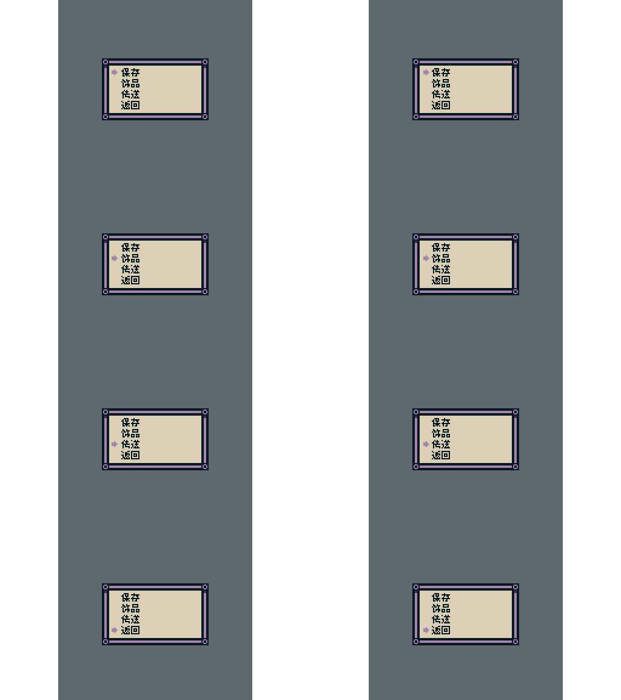

# 2026-10-09 游戏更新适配记录

Steam Build **25818045** 的正式汉化补丁 **25818045.01** 已生成，并安装到本机游戏。用户于 2026-10-09 回复“全部通过”，[新增译句审查表](新增译句审查_2026-10-09.md)中的 11 句译文已加入正式词典，词典由 4,195 条增加到 4,206 条。

## 官方更新

新版英文资源 74,089,078 字节，MD5 为 **f4d502c77ac83211267fece9df8f33a9**；上一版英文 MD5 为 **de010887cb6fa586eb6b08bd1e302573**。

资源从 801 项增加到 805 项：144 项修改、5 项新增、1 项移除。新增 SQD1 区域、污泥射击雕像、四选项存档菜单及相关图集；保留新版 objRefTable.js、c3runtime.js 的官方代码和所有事件数据。

全局按对象名、动画名和帧编号比较 17,952 个旧帧与 17,987 个新帧，避免对象序号和图集移动造成误判：35 帧新增、0 帧移除、3 帧像素变化、291 帧跨图集移动。发生实际像素变化的是 MiniMap 和 LeverSwitch 的 D1_1 / D1_2 帧，全部保留新版画面。

## 汉化改动

185 个原有汉化文字帧的像素、尺寸与帧属性均保持上版结果。地图总览、图例、定位与返回提示、读取存档确认框已经按新图集位置重绘。

新增 SaveTrinketBack2 四选项存档菜单，覆盖四个选中状态的全部 8 个交替帧，沿用已审校译名“保存 / 饰品 / 传送 / 返回”。重绘仅发生在四行文字区域，边框、背景和选中箭头保持官方原图。

替换资源清单改为 27 张图片，并保留历史官方包 MD5 对应的精确图片清单，以便从旧版适配工具迁移。更新重建规则精确绑定本次新旧英文包 MD5 和 14 张原始变更图集，未知版本继续通过原有检查流程核对。

## 译句审查

对比运行时全部新增字符串，并检查全部 24 种字体对象、74 个静态文字实例。静态文字没有新增或改写；发现 11 句新增或改写对白。内部对象名、事件分组名以及此前要求保留英文的制作名单保持现有处理方式。

11 句译文及语境已列入审查表并全部经用户通过。正式词典和运行时精确匹配、大小写回退词典已加入这 11 句；原有 4,195 条译文全部保持一致，运行时汉化代码除这两份词典外与上版一致。新增译文没有超出当前 1,873 字汉字集合。

## 验证

- 资源包签名、字体引用、解包重打包一致性、JavaScript 语法、资源清单检查通过。
- 24 张中文字体图集与上版逐字节一致，44,952 个汉字字格全部正确，翻转和不符均为 0。
- 17,987 个官方动画帧的尺寸和属性保留；185 个现有文字帧与上版一致，8 个新增存档菜单帧汉化，其他动画帧逐帧保留新版官方像素。
- 项目数据完整性检查通过：除字体设置、既有存档摘要排版及汉化图片字节数外，data.json 与新版官方内容一致；全部事件数据相同。
- 官方运行时前缀完整保留；objRefTable.js 及未列入汉化清单的资源逐文件保持官方内容。
- 8 项沙盒安装测试通过：匹配英文安装、重复安装、卸载、重复卸载，以及拒绝旧英文资源、旧游戏版本汉化、错误英文备份和未知新资源。
- 在没有开发解包快照的独立目录中运行正式交付工具，重建包与正式包逐字节一致；新版英文备份、旧备份归档以及 --no-install 行为全部正确。

本轮没有执行全流程实机游玩验收。

## 当前交付状态

正式包共 829 项资源：官方 805 项 + 24 张中文字体图集；相对新版英文修改 29 项、新增 24 项、删除 0 项。正式资源为 **74,978,534 字节**，MD5 为 **48d16cfcd1ba32126cb6cf7acf8adb15**。

根目录交付文件与正式构建结果已同步，本机游戏安装资源与交付包逐字节一致。当前英文备份为本次 Build 的官方原包；旧英文备份已归档保留。

发布压缩包：release/Isle_of_Reveries_v25818045.01.zip，附同名 SHA256 校验文件。压缩包包含正式资源、安装/卸载/重建脚本、词典、字体、当前工具、文档及验证报告，不包含开发解包快照或候选包。ZIP 全部条目已完成 CRC 与源文件 SHA256 核对。

审计脚本、报告、原版快照和沙盒位于 release/review_20261009/，该目录按项目约定不纳入 Git。
